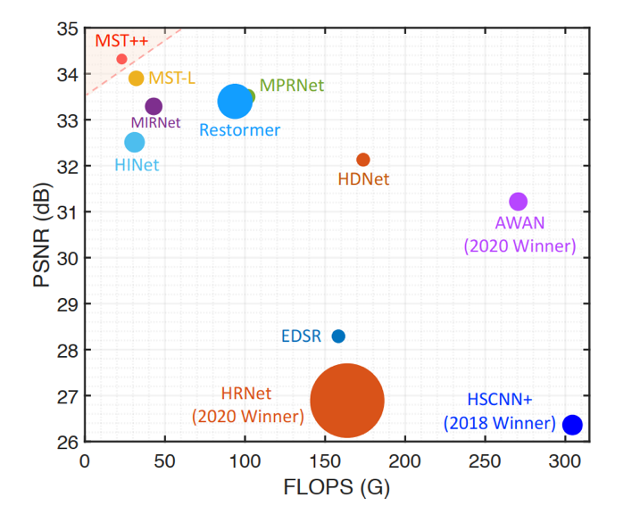

## MST++ TensorRT模型加速优化 :zap:
### MST++: Multi-stage Spectral-wise Transformer for Efficient Spectral Reconstruction for TensorRT 2022

:construction_worker: : **美迪康AI Lab**

### 0.日志

|时间|提交内容|说明|
|-|-|-|
|2022-05-26|团队合作选题，确定MST++作为TensorRT的优化模型|选题|
|2022-05-27|选题完毕，github项目主页创建，并发布了"原始模型"部分|项目创建|

### 1.总述

+ TODO

### 2.原始模型

#### 2.1 模型简介

优化的模型来源于：MST++: Multi-stage Spectral-wise Transformer for Efficient Spectral Reconstruction

|名称|参考连接|
|-|-|
||<https://arxiv.org/abs/2111.07910>|
||<https://arxiv.org/abs/2204.07908>|
||<https://github.com/caiyuanhao1998/MST/>|
||<https://github.com/caiyuanhao1998/MST-plus-plus>|
|| <https://zhuanlan.zhihu.com/p/501101943>|

> :memo: 为什么选择MST++作为TensorRT的优化模型？

+ MST 被 CVPR 2022 接收，其改进版 MST++ 被 CVPRW 2022 接收，并且在 NTIRE 2022 Spectral Reconstruction Challlenge 中取得第一名。 两个模型是首个基于Transformer的高光谱图像重建方法。
+ 网络结构方面：MST和MST++基本结构单元均依赖于self-Attention,其在K, Q，V矩阵的计算上有些许的不同，网络结构上每个block采用了类似于U-Net的U型结构。其基于Self-Attention的MSAB结构和SAB结构是TensorRT性能优化的重点。
+ 网络性能方面：在原训练框架的精度和性能上，MST和MST++表现SOTA,在图像重建领域是最应该被考虑的可以作为实际应用的方案。两个网络更应该需要有成熟的TensorRT解决方案。
+ 网络是最新的Transformer在图像重建领域的应用，暂无开源TensorRT模型加速的优化方案。

##### 2.1.1 首先介绍MST

MST是一个**对称的U型网络**

其基本组成单元为Mask-guided Self-Attention Block(**MSAB**), **MSAB**中最重要的结构是Mask-guided Spectral-wize Multi-head Self-Attention(**MS-MSA**)

如上图：**MSAB**包含2个Layer Norm(LN) ，1个MS-MSA和1个前向神经网络FFN！！！

如上图：最重要的**MS-MSA**结构可以拆解为2个部分，即Mask-guided Mechanism(MM)个Spectral-wize Multi-head Self-Attention(S-MSA)

S-MSA: 通常来说，之前的Transformer将一个 pixel vector 作为一个token。然而，高光谱具有空间稀疏而通道上高度相似的特性，因此，计算空间维度的 self-attention 会比计算光谱通道维度的 self-attention 更加低效。基于这样一个motivation，S-MSA 将每一个光谱通道的特征图作为一个 token 去计算 self-attention。

MM: 为了获得保真度随空间位置变化的信息，将 mask 作为输入生成 Mask Attention Map，然后作用在 S-MSA 的 value 上。

最终：通过改变 MST 中各层 block 的数量 （N1, N2, N3）来得到一簇 MST family，他们是 MST-S (2, 2, 2), MST-M (2, 4, 4), MST-L (4, 7, 5).

##### 2.1.2 其次介绍MST++

MST++是MST的后续工作，其全称为Multi-stage Spectral-wize Transformer,顾名思义就是将MST中的MM去掉，然后改成首尾串联的多阶段网络，输入变成了RGB图像，输出还是HSI.

+ MST++由N个SST级联得到
+ SST中由原来MST中的MSAB替换为SAB,SAB中将原来的MS-MSA替换为了S-MSA
+ MST++input是一个RGB的图像，output是HSI

**综上两个网络结构的介绍，MST和MST++基本结构单元均依赖于self-Attention,其在K,Q，V矩阵的计算上有些许的不同，网络结构上每个block采用了类似于U-Net的U型结构。**

上图可以发现，MST,MST++在精度和性能上的均衡上表现SOTA,在图像重建领域是最应该被考虑的可以作为实际应用的方案。

#### 2.2 模型优化难点

+ TODO

### 3.优化过程

+ TODO

### 4.精度与加速效果

+ TODO

### 5.Bug报告

|BUG名称|issue|是否被确认|
|-|-|-|
|TensorRT8.2.3 SkipLayerNorm :bug:|<https://github.com/NVIDIA/TensorRT/issues/1919>|:white_check_mark:|

### 6.经验与体会

+ TODO
