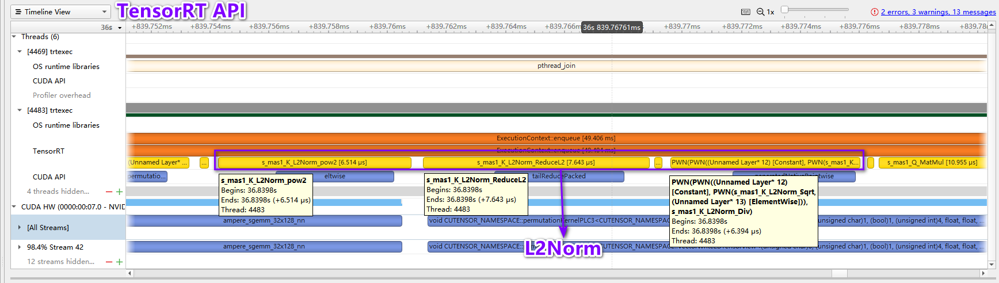
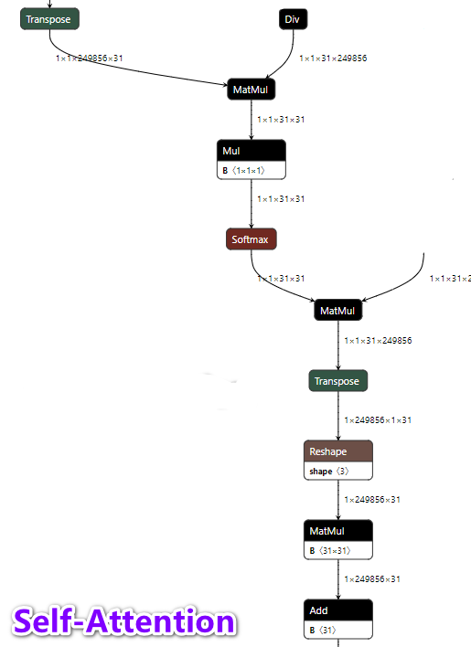
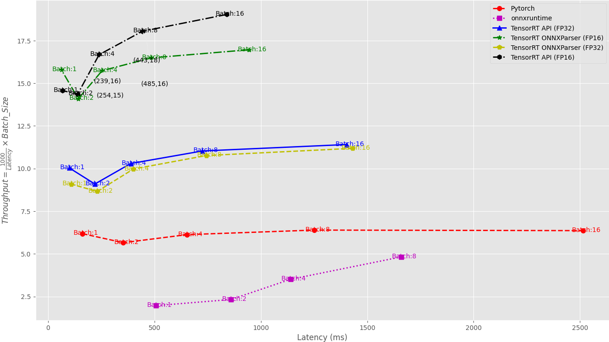
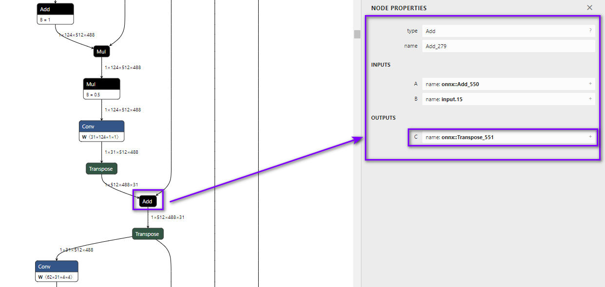

<!--  -->


## MST++ TensorRT模型加速优化 :zap:
### MST++: Multi-stage Spectral-wise Transformer for Efficient Spectral Reconstruction for TensorRT Hackathon 2022

[](https://github.com/NVIDIA/TensorRT)
[](https://tianchi.aliyun.com/competition/entrance/531953/introduction?spm=5176.12281957.1004.2.38b23eafjHlB6l)
[](https://github.com/NVIDIA/trt-samples-for-hackathon-cn)
[](https://www.bilibili.com/video/BV15Y4y1W73E?spm_id_from=333.337.search-card.all.click&vd_source=def8c63d9c5f9bf987870bf827bfcb3d)
[](https://www.bilibili.com/video/BV1i3411G7vN?spm_id_from=333.999.0.0&vd_source=def8c63d9c5f9bf987870bf827bfcb3d)
[](https://github.com/caiyuanhao1998/MST-plus-plus)


:alien: : **美迪康AI Lab** 

### 0.♿️日志

<div align=center>

|时间点|提交内容|说明|
|-|-|-|
|2022-05-26|团队合作选题，确定MST++作为TensorRT的优化模型|选题|
|2022-05-27|选题完毕，github项目主页创建，并发布了"原始模型"部分|项目创建|
|2022-06-05|基于Nsight完成Profiling,确定使用Plugin和TensorRT API优化模型  |优化方案确定|
|2022-06-11|完成TRT ONNXParser和TRT API两个方案的模型优化和调整 |优化方案实现|
|2022-06-12|完成FP32,FP16下Pytorch,onnxruntime, TRT ONNXParser,TRT API 的benchmark的对比|benchmark计算|
|2022-06-15|完成FP32,FP16下Pytorch,onnxruntime, TRT ONNXParser,TRT API 的精度的对比|精度计算|
|2022-06-18|完成INT8量化|INT8量化|
|2022-06-22|INT8量化结果分析|INT8量化|
|2022-06-23|最终结果在TensorRT 8.4GA重跑复现|结果复现|
|2022-06-26|项目报告书写|书写报告|

</div>

### 1.总述

我们优化的模型为：MST++,一个RGB-to-HSI的首个基于Transformer的图像重建模型。其原始模型的相关链接如下：

<div align=center>

|名称|参考连接|
|-|-|
||<https://arxiv.org/abs/2111.07910>|
||<https://arxiv.org/abs/2204.07908>|
||<https://github.com/caiyuanhao1998/MST/>|
||<https://github.com/caiyuanhao1998/MST-plus-plus>|
|| <https://zhuanlan.zhihu.com/p/501101943>|

</div>

我们主要采用2条主线优化该网络，`TensorRT ONNXParser`和`TensorRT API`两种方式。基于对ONNXParser用Nsight进行Profiling,并最终确定了有针对性的优化方案，包括：

+ 网络中存在大量的`Transpose+Reshape`操作较为耗时
+ 卷积，分组卷积和转置卷积
+ Self-Attention 冗余结构耗时

针对于上述问题我们简化网络结构通过TensorRT API重新搭建了网络结构，实现了`L2Norm`,`Self-Attention`,`LayerNorm`,`卷积，分组卷积，反卷积`和MST++的`S_MSA`核心结构.

+ L2Norm结构的耗时
+ LayerNorm结构耗时
+ Gelu结构耗时

针对于上述结构我们开发了一些Plugin同时借鉴已有的Plugin在TensorRT API通过合并算子引入`Normalization Plugin`,`LayerNorm plugin`和`Gelu Plugin`.

整体的优化过程如下图所示：


我们分别对比了该模型在Pytorch(原训练框架)，onnxruntime, TensorRT ONNXParser, TensorRT API的延迟，吞吐量和加速比以及衡量精度的绝对误差和相对误差的均值，最大值和中位数（将在下面给出详细说明）
最终：

+ 在延迟，吞吐量，加速比，吞吐比上基于TensorRT API和Plugin的方式在FP32和FP16上整体优于其他方式；
+ ONNXParser FP32模式下加速比维持在1.47-2.55,在FP16模式下加速比维持在2.49-2.67;
+ TensorRT API FP32模式下加速比维持在1.61-1.79,在FP16模式下加速比维持在2.36-2.99;
+ onnxruntime对此模型没有加速效果;
+ 在绝对和相对误差上，TensorRT API中因大维度的ReduceSum和Plugin的误差问题精度整体略低于ONNXParser方式;
+ FP32模式下的绝对误差:ONNXParser可控制在
$10^{-6}$,TensorRT API控制在$10^{-5}$;
+ FP16模式下的绝对误差:ONNXParser可控制在$10^{-3}$,TensorRT API控制在$10^{-2}$；
+ 相对误差有类似的结果;
+ 此外我们完成了INT8量化并分析了其速度和精度。

最后我们对本项目需要的环境，项目结构和运行方式进行说明：

> :black_nib: 1.项目所需环境

<details>
<summary>点我查看所需环境</summary>

+ 主机硬件环境：`Linux version 5.4.0-110-generic (buildd@ubuntu) (gcc version 9.4.0 (Ubuntu 9.4.0-1ubuntu1~20.04.1)) `, NVIDIA显卡： `NVIDIA A10 (24G)`

+ 主机软件环境：`Driver Version: 510.73.08`, `CUDA 11.6/cuDNN8.4/TRT8.4`, `Docker`和`NVIDIA-Docker`

+ Docker镜像的使用具体可以参考：<https://github.com/NVIDIA/trt-samples-for-hackathon-cn/blob/master/hackathon/setup.md>

```shell
# 拉取镜像
nvidia-docker pull registry.cn-hangzhou.aliyuncs.com/trt2022/dev
# 启动容器
nvidia-docker run -it --name trt2022 -v ~/trt2022_src:/target registry.cn-hangzhou.aliyuncs.com/trt2022/dev
```

+ 容器内需要按照如下安装环境
```shell
# 安装必要的python package
pip3 install -r requirements.txt -i  https://mirrors.aliyun.com/pypi/simple/
# 因过程中安装了opencv，需要安装libgl1
apt-get update && apt-get install libgl1
```

>:warning: 注: 
>
>    1.本项目的测试结果依赖于上述环境
> 
>    2.本项目同时用TensorRT 8.4GA版进行了测试，经测试，测试结果的一致性是相同的，TensorRT 8.4GA镜像: `registry.cn-hangzhou.aliyuncs.com/trt2022/trt-8.4-ga`

</details>


> :black_nib: 2.项目结构说明


<details>
<summary>点我查看项目结构</summary>

```shell
.
├── architecture          # MST++模型相关的python代码(主要来源https://github.com/caiyuanhao1998/MST-plus-plus)
│   ├── README.md
│   ├── __init__.py
│   ├── edsr.py  
│   ├── HDNet.py  
│   ├── hinet.py     
│   ├── hrnet.py
│   ├── HSCNN.py
│   ├── MIRNet.py
│   ├── MPRNet.py  
│   ├── MST.py  
|   ├── Restormer.py      # 以上python代码是MST++对比的其他模型的结构比如edsr,HDNet,...,MST    
│   └── MST_Plus_Plus.py  #  MST++模型结构
|
├── data   # 测试数据，来源于MST++ GitHub项目，代码提交时具体数据不提供,详见该文件夹下的readme
│    ├── ARAD_1K_0001.jpg   
│    └── ARAD_1K_0002.jpg  
├── model  # 模型存放位置，pth模型，onnx模型，模型权重文件，plan文件,提供模型`下载云盘地址`,详见该文件夹下的readme
|
├── docs   # README的静态资源文件存放
|
├── LayerNormPlugin      # LayerNorm Plugin 
│   ├── layer_norm.cuh
│   ├── LayerNormPlugin.cu
│   ├── LayerNormPlugin.h
│   └── Makefile
|
├── NormalizePlugin      # Normalization Plugin (L2Norm)
│   ├── NormalizePlugin.cu
│   ├── NormalizePlugin.h
│   └── Makefile
|
├── torch2onnx.py       # pytorch模型转onnx模型
├── get_weights.py      # 获取模型权重文件
├── mst_config.ini      # tensorRT API模型结构配置文件
├── calibrator.py       # int8量化数据加载生成量化cache
├── mst_onnxparser.py   # onnxparser方式的INT8量化生成plan文件
├── mst_trt_api.py      # TensorRT API方式生成TensorRT plan **（核心文件）
├── performance_latency.py    # benchmark的计算和可视化
├── performance_accuracy.py   # 精度的计算和可视化
├── performance_int8.py # int8量化benchmark和精度的计算和可视化
├── build.sh            # 完整运行本项目的全部命令，可以执行./build.sh运行(但是会很耗时！)
|
├── requirements.txt    # Python package安装列表
├── LICENSE     
└── README.md
```

</details>


> :black_nib: 3.运行方式说明

<details>
<summary>点我查看运行方式</summary>

+ 1.Pytorch模型转ONNX

```shell
python3 torch2onnx -h
# 为了测试可以生成任意batch_size：[1,2,4,8,16]（为了避免维度的复杂变换和额外结点，我们尽量避免使用Dynamic shape(个人认为能不用dynamic shape就不用！)
python3 torch2onnx --batch_size=1 --onnx_path=./model/mst_plus_plus_b1.onnx --simplifier
```

+ 2.TensorRT ONNXParser模型序列化

```shell
#FP32
trtexec --onnx=./model/mst_plus_plus_b1.onnx --saveEngine=./model/mst_plus_plus_onnxparser_b1.plan --workspace=3000 --verbose

#FP16
trtexec --onnx=./model/mst_plus_plus_b1.onnx --saveEngine=./model/mst_plus_plus_onnxparser_b1_fp16.plan --workspace=3000 --verbose --fp16
```

+ 3.使用Nsight Profiling ONNXParser

```shell
nsys profile -o mst_onnx trtexec --loadEngine=./model/mst_plus_plus_onnxparser_b1.plan --warmUp=0 --duration=0 --iterations=50 --plugins=./LayerNormPlugin.so
```

关于Plugin的编译可以直接进入对应的文件夹执行`make`编译得到`so`文件,将编译好的`so`文件移动到项目根目录`mv *.so ../`


+ 4.TensorRT API 模型序列化

```shell
# 获取模型weights用于TensorRT API搭建网络
python3 get_weight.py -h
# 我们已经帮大家生成好了各batch size下的权重文件，该部分不需要执行
#python3 get_weight.py --model_path=./model/mst_plus_plus_b1.onnx --weight_path=./model/mst_plus_plus_weights_b1.npz

# TensorRT API FP32
python3 mst_trt_api.py -h
python3 mst_trt_api.py --batch_size=1 --mode=FP32 --plan_path=./model/mst_plus_plus_b1.plan --weight_path=./model/mst_plus_plus_weights_b1.npz

# FP6
python3 mst_trt_api.py --batch_size=1 --mode=FP16 --plan_path=./model/mst_plus_plus_b1_fp16.plan --weight_path=./model/mst_plus_plus_weights_b1.npz
```

+ 5.使用Nsight Profiling TensorRT API模型

```shell
nsys profile -o mst_trt_api trtexec --loadEngine=./model/mst_plus_plus_b1.plan --warmUp=0 --duration=0 --iterations=50 --plugins=./LayerNormPlugin.so --Plugins=NormalizePlugin.so
```

+ 6.benchmark的计算包括：Pytorch,onnxruntime, TensorRT ONNXParser, TensorRT API的延迟，吞吐量，加速比等

```shell
# 该部分比较耗时，且需要生成batch_size为[1,2,4,8,16]的onnxparser和tensorrt api的plan模型
python3 performance_latency.py
```

+ 7.精度的计算包括： Pytorch,onnxruntime, TensorRT ONNXParser, TensorRT API的绝对和相对误差的均值最大值，中位数

```shell
# 该部分比较耗时，且需要生成batch_size为[1,2,4,8,16]的onnxparser和tensorrt api的plan模型，并且需要准备1000张测试图像，具体图像可以在MST++ github主页获取。
python3 performance_accurcay.py
```


+ 8.TensorRT API方式的INT8量化

```shell
# 以batch_size=1为例
python3 mst_trt_api.py --batch_size=1 --mode=INT8 --calibration_table_path=./model/mst_calibration_b1.cache --plan_path=./model/mst_plus_plus_b1_int8.plan --weight_path=./model/mst_plus_plus_weights_b1.npz
#s_msa block中的第一个分组卷积不能INT8!
```

+ 9.TensorRT ONNXParser方式的INT8量化

```shell
# 以batch_size=1为例
python3 mst_onnxparser.py --batch_size=1 --mode=INT8 --calibration_table_path=./model/mst_calibration_onnxparser_b1.cache  --onnx_path=./model/mst_plus_plus_b1.onnx --plan_path=./model/mst_plus_plus_onnxparser_b1_int8.plan
```

+ 10.INT8模型的benchmark和精度的计算

```shell
python3 performance_int8.py
```

> 下面涉及到的所有结果可以通过执行如下命令进行复现( 耗时较长！！！ )
```shell
chmod -R 777 ./build.sh
./build.sh
```

</details>


### 2.原始模型

#### 2.1 模型简介

优化的模型来源于：MST++: Multi-stage Spectral-wise Transformer for Efficient Spectral Reconstruction. 它是RGB-to-HSI的图像重建方法。高光谱图像（HSI）指的是光谱分辨率在$10^{-2}\lambda$数量级范围内的光谱图象。相交于RGB图像而言，高光谱有更多的波段（即通道数更多）来更加准确全面的描述被捕获的场景的特性。很多时候，从RGB图像无法观测到异常，但是从高光谱图像的某一个波段中确能一眼看出问题所在，举个例子，比如在深夜使用红外光谱，就可以清晰的看到发热的活物，正因如此，HSI被广泛的应用于目标检测和跟踪，图像识别，遥感，医疗影像等领域。而传统的技术采集HSI图像需要特定的设备，而这些设备又比较昂贵。因此MST++这种可以直接从RGB重建HSI图像的技术有非常大的应用场景。


> :black_nib: 为什么选择MST++作为TensorRT的优化模型？

+ MST 被 CVPR 2022 接收，其改进版 MST++ 被 CVPRW 2022 接收，并且在 NTIRE 2022 Spectral Reconstruction Challlenge 中取得第一名。 两个模型是首个基于Transformer的高光谱图像重建方法。
+ 网络结构方面：MST和MST++基本结构单元均依赖于self-Attention,其在K, Q，V矩阵的计算上有些许的不同，网络结构上每个block采用了类似于U-Net的U型结构。其基于Self-Attention的MSAB结构和SAB结构是TensorRT性能优化的重点。
+ 网络性能方面：在原训练框架的精度和性能上，MST和MST++表现SOTA,在图像重建领域是最应该被考虑的可以作为实际应用的方案。两个网络更应该需要有成熟的TensorRT解决方案。
+ 网络是最新的Transformer在图像重建领域的应用，暂无开源TensorRT模型加速的优化方案。

##### 2.1.1 首先介绍MST

MST是一个**对称的U型网络**

<div align=center>

</div>


其基本组成单元为Mask-guided Self-Attention Block(**MSAB**), **MSAB**中最重要的结构是Mask-guided Spectral-wize Multi-head Self-Attention(**MS-MSA**)


<div align=center>

</div>


如上图：**MSAB**包含2个Layer Norm(LN) ，1个MS-MSA和1个前向神经网络FFN！！！

<div align=center>

</div>


如上图：最重要的**MS-MSA**结构可以拆解为2个部分，即Mask-guided Mechanism(MM)个Spectral-wize Multi-head Self-Attention(S-MSA)

S-MSA: 通常来说，之前的Transformer将一个 pixel vector 作为一个token。然而，高光谱具有空间稀疏而通道上高度相似的特性，因此，计算空间维度的 self-attention 会比计算光谱通道维度的 self-attention 更加低效。基于这样一个motivation，S-MSA 将每一个光谱通道的特征图作为一个 token 去计算 self-attention。

MM: 为了获得保真度随空间位置变化的信息，将 mask 作为输入生成 Mask Attention Map，然后作用在 S-MSA 的 value 上。

最终：通过改变 MST 中各层 block 的数量 （N1, N2, N3）来得到一簇 MST family，他们是 MST-S (2, 2, 2), MST-M (2, 4, 4), MST-L (4, 7, 5).

##### 2.1.2 其次介绍MST++

MST++是MST的后续工作，其全称为Multi-stage Spectral-wize Transformer,顾名思义就是将MST中的MM去掉，然后改成首尾串联的多阶段网络，输入变成了RGB图像，输出还是HSI.


<div align=center>

</div>


+ MST++由N个SST级联得到
+ SST中由原来MST中的MSAB替换为SAB,SAB中将原来的MS-MSA替换为了S-MSA
+ MST++input是一个RGB的图像，output是HSI

**综上两个网络结构的介绍，MST和MST++基本结构单元均依赖于self-Attention,其在K,Q，V矩阵的计算上有些许的不同，网络结构上每个block采用了类似于U-Net的U型结构。**

<div align=center>

</div>


上图可以发现，MST,MST++在精度和性能上的均衡上表现SOTA,在图像重建领域是最应该被考虑的可以作为实际应用的方案。


#### 2.2 模型优化难点

该模型的优化难点如下：

+ 模型在导出ONNX过程中比较顺利，但是如果使用ONNXParser的方式优化模型，需要对模型做simplifier,否则无法进行正常序列化。
+ 针对于ONNXParser加速比低的原因，模型结构中存在一些比较耗时的OP可以通过Plugin和TensorRT API的方式进一步优化网络。
+ FP16模式下精度相关的问题
+ INT8量化相关的精度和速度等问题。


### 3.优化过程

整体的优化方案可以参考第一部分给出的优化的流程图，我们主要基于TensorRT ONNXParser和TensorRT API两种方案进行优化，下面我们将详细介绍具体的优化细节。

#### 3.1 FP32，FP16下的具体优化细节

首先基于MST++的模型结构和ONNX模型的可视化结构我们发现，整体的模型是由`S_MSA block`按照类似于UNet的方式堆叠而成，整个网络包含15个`S_MSA block`,关于`S_MSA block`其结构如下图所示：

<div align=center>

</div>

`S_MSA`是由上图中的三个部分按照节点拼接而成。上述结构中不难发现其主要包含如下重要的结构： `L2Norm`, `Self-Attention`, `Gelu`,`LayerNorm`等，下面我们通过Nsight进行Profiling,并进行针对性的优化。

我们发现网络中的`L2Norm`,`Self-Attention`,`Gelu`,`LayerNorm`这些结构的耗时，并发现网络中存在大量的`Transpose+Reshape`结构和基于卷积，分组卷积和转置卷积的操作。为了解决这些优化问题我们给出的解决方案是通过TensorRT API的方式搭建网络进行TensorRT的优化同时使用Plugin融合部分算子进行进一步的优化，其优化的细节如下：

:black_medium_small_square: L2Norm

<div align=center>

</div>

每个`S_MSA block`包含2个`L2Norm`结构，整个网络共30个`L2Norm`结构出现，基于ONNXParser，在Nsight下发现`L2Norm`的耗时情况如下图所示：

<div align=center>

</div>

其在一个block中的一个`L2Norm`的耗时为 $26.164\mu s$，而经过我们TensorRT API和Plugin的优化方案后，相同位置的`L2Norm`结构的Nsight如下：

<div align=center>

</div>

优化后的同位置的`L2Norm` Profiling的耗时为：$20.551\mu s$,缩短了 $5.613\mu s$.  综上针对`L2Norm`的优化方案为：开发了L2Norm Plugin同时用TensorRT API实现了L2Norm,对比发现TensorRT API方式更快，最终选择TensorRT API方式。过程中我们还发现了TensorRT 官方Plugin中的Normalize Plugin的Bug,关于该Bug可以参考第五部分。

:black_medium_small_square: Self-Attention

<div align=center>

</div>

每个block中包含一个`Self-Attention`结构,整个网络包含15个`Self-Attention`结构。基于ONNXParser，在Nsight下发现`Self-Attention`的耗时情况如下图所示：

<div align=center>

</div>

其在一个block中的一个`Self-Attention`的耗时为 $85.550\mu s$，而经过我们TensorRT API和Plugin的优化方案后，相同位置的`Self-Attention`结构的Nsight如下：

<div align=center>

</div>

优化后的同位置的`Self-Attention` Profiling的耗时为：$62.127\mu s$,缩短了 $23.423\mu s$.  综上针对`Self-Attention`的优化方案为：使用TensorRT API 重新实现了`Self-Attention`,删除替换了不必要的操作，过程中融合了部分算子。由于时间关系我们并未针对于Self Attention进行Plugin的开发，会在未来进行(参考第六部分)。

:black_medium_small_square: Gelu

<div align=center>

</div>

每个block中包含三个`Gelu`激活结构,整个网络包含45个`Gelu`结构。基于ONNXParser，在Nsight下发现`Gelu`的耗时情况如下图所示：

<div align=center>

</div>

发现在ONNXParser中`Gelu`结构被合并为1个kernel进行优化，其在一个block中的一个`Gelu`的耗时为 $4.531\mu s$，而经过我们TensorRT API和Plugin的优化方案后，相同位置的`Gelu`结构的Nsight如下：

<div align=center>

</div>

优化后的同位置的`Gelu` Profiling的耗时为：$4.048\mu s$,缩短了 $0.483\mu s$.  综上针对`Gelu`的优化方案为：使用Gelu Plugin替换了网络中的`Gelu`结构，通过TensorRT API的方式进行优化。该Plugin来源于TensorRT官方Plugin库。

:black_medium_small_square: LayerNorm

<div align=center>

</div>

每个block中包含一个`LayerNorm`结构,整个网络包含15个`LayerNorm`结构。基于ONNXParser，在Nsight下发现`LayerNorm`的耗时情况如下图所示：

<div align=center>

</div>

其在一个block中的一个`LayerNorm`的耗时为 $31.854\mu s$，而经过我们TensorRT API和Plugin的优化方案后，相同位置的`LayerNorm`结构的Nsight如下：

<div align=center>

</div>

优化后的同位置的`LayerNorm` Profiling的耗时为：$11.014\mu s$,缩短了 $20.84\mu s$.  综上针对`LayerNorm`的优化方案为：开发了LayerNorm Plugin替换了网络中的`LayerNorm`结构，通过TensorRT API的方式进行优化。

:black_medium_small_square: 其他

除此之外我们发现网络结构中存在大量的`Transpose+Reshape`结构，这些结构是可以通过TensorRT API在设计网络的时候被合并的

<div align=center>

</div>

其在ONNXParser中的profiling的耗时情况：

<div align=center>

</div>

在使用TensorRT API搭建网络时可以一定程度的减少这些结构的出现，起到进一步的加速效果。

另外，MST++网络中在每个`S_MSA block`和`Gelu`激活间使用了卷积，分组卷积和反卷积，而TensorRT API的实现方式相比于ONNXParser可能更高效(该观点我们在瞎说没有验证)。


综上所述，FP32和FP16下我们通过2种方式：TensorRT ONNXParser和TensorRT API， 并配合开发的TRT Plugin，对MST++模型进行一步一步的性能优化，并取得了一定的性能优化成果。关于INT8量的细节和性能优化指标的展示我们将在下文展示。


#### 3.2 INT8量化的细节

我们实现了TensorRT ONNXParser和TensorRT API两种方式的PTQ INT8量化，对于TensorRT API, INT8量化可执行如下操作：

```shell
# 以batch_size=1为例
python3 mst_trt_api.py --batch_size=1 --mode=INT8 --calibration_table_path=./model/mst_calibration_b1.cache --plan_path=./model/mst_plus_plus_b1_int8.plan --weight_path=./model/mst_plus_plus_weights_b1.npz
```
执行该操作，TensorRT会创建calibration table,序列化engine,但过程中会如下错误：

<div align=center>

</div>

通过屏蔽代码的方式，如上图所示，我们最终定位到是由于`s_msa` block中的第一个分组卷积导致的一个` [TRT] [E] 1: Unexpected exception`错误。我们线下尝试了两种解决方案：

+ 通过混合精度的方式强制将该层的精度设置`FP32`
+ 注意到分组卷积使用的`tactic`为`CuDNN`,强行设置`TacticSource`

发现上述两种方式均未解决该错误。由于该错误的报错信息较少，目前我们仅定位到出现该问题的层，但是没有找到解决方案，也不确定是否为INT8量化在TensorRT API中的Bug。

最终我们仅成功运行了TensorRT ONNXParser方式的INT8量化，该方式的INT8量化可以通过如下方式实现：

```shell
# 以batch_size=1为例
python3 mst_onnxparser.py --batch_size=1 --mode=INT8 --calibration_table_path=./model/mst_calibration_onnxparser_b1.cache  --onnx_path=./model/mst_plus_plus_b1.onnx --plan_path=./model/mst_plus_plus_onnxparser_b1_int8.plan
```

关于INT8量化的benchmark和精度的测试，我们在下一节中进行了介绍。


### 4.精度与加速效果

> :warning: 本节测试环境和第一部分总述中的项目所需环境保持一致。

#### 4.1 性能测试

本项目对比了MST++在PyTorch, onnxruntime, TensorRT ONNXParser和TensorRT API这4种方式下的FP32和FP16模式下的延迟(Latency),吞吐量(Throughput),加速比(Latency Speedup), 吞吐比(Throughput Speedup)的差异，其对比结果如下表所示。这里需要注意的是下表提供的对比数据是保证了在各框架input数据的一致性的情况下的随机生成的数据（这一点和精度测试是不同的，精度测试使用了真实的测试数据），统计数据仅包含模型推断部分而不包含模型的前后处理部分，每一个统计数据的模拟次数是1050次，其中前50次推断不作为统计数据计入。

<div align=center>

</div>

从上表可知，标红数据为相同模型精度下加速比的最大值出现位置，以原训练框架PyTorch为基准，onnxruntime-gpu整体没有加速效果，TensorRT ONNXParser FP32模式下加速比可以维持在 $1.47-1.76$, 整体在FP32模式下，TensorRT API的方式加速比可以维持在 $1.61-1.79$为FP32最优的方案。Throughput Speedup指标有相似的对比结果。

FP16模式下，在`batch size=1`的情况下，TensorRT ONNXParser的加速效果最好，其加速比为2.55，而TensorRT API为2.36；但其他batch size下，TensorRT API方式的加速效果均要优于TensorRT ONNXParser方式，FP16模式下整体TensorRT API的加速效优于TensorRT ONNXParser。Throughput Speedup指标有相似的对比结果。

<div align=center>

</div>

除此之外，我们绘制了Latency和Throughput的关系折线图，如上图所示，我们可以直观的看到不同框架的加速情况，并可以根据该图在不同batch size下选择不同的加速方式实现。比如FP16下，如果推断的batch size为1，则我们建议使用ONNXParser的加速方式，FP32和其他batch size设定下的FP16模式，我们建议使用TensorRT API方式做模型加速。

#### 4.2 精度测试

关于精度测试的验证采取的方式是绝对误差和相对误差的均值，中位数和最大值，因该任务是图像重建类型的的模型，
我们采用预测结果图像的子图(这里的方式和MST++测试代码，NTIRE 2022 Spectral Reconstruction Challlenge的比赛评估保持一致)，为了消除异常值的影像并去掉了最大值和最小值，然后再去统计对应的绝对误差和相对误差的均值，中位数和最大值。

项目基于1000张真实的测试集测试数据，测试了onnxruntime,TensorRT ONNXParser和TensorRT API的推断的精度，最终的测试结果如下图所示。

<div align=center>

</div>

上图展示了几种推断框架的绝对误差的均值，最大值和中位数的分布情况，我们发现FP32模式下，onnxruntime和TensorRT ONNXparser的绝对误差基本在 $10^{-6}$，而TensorRT API的绝对误差基本维持在 $10^{-5}$，精度相比于ONNXParser稍低（我们将在本节最后给出具体原因）。FP16模式下有相似的结果，TensorRT ONNXparser绝对误差维持在 $10^{-3}$,而TensorRT API的绝对误差维持在 $10^{-2}$，精度稍低（我们将在本节最后给出具体原因）。

对于相对误差的计算结果，如下图所示:

<div align=center>

</div>

上图展示了几种推断框架的相对误差的均值，最大值和中位数的分布情况，我们发现FP32模式下，onnxruntime和TensorRT ONNXparser的相对误差基本在 $10^{-5}$，而TensorRT API的相对误差基本维持在 $10^{-4}$，精度相比于ONNXParser稍低（我们将在本节最后给出具体原因）。FP16模式下有相似的结果，TensorRT ONNXparser相对误差维持在 $10^{-2}$,而TensorRT API的相对误差维持在 $10^{-1}$，精度稍低（我们将在本节最后给出具体原因）。

综上我们计算对比了不同框架下的绝对误差和相对误差的均值，中位数和最大值，并发现TensorRT API的方式在相对误差和绝度误差的精度上均比ONNXparser的方式稍低。我们依此分析了产生该结果的原因，我们通过TensorRT的工具`onnx graphsurgeon`获取了MST++的子图（该过程代码仓库未体现），基于该子图进行TensorRT ONNXParser和TensorRT API方式的搭建，我们找到了产生该结果的原因。之所以TensorRT API整体误差稍大，我们在代码层面上找到了具体原因，其原因如下：

+ TensorRT API实现的大维度的`ReduceSum`和ONNXParser是不同的，我们在对比结果的时候发现有偏差, TensorRT API的方式精度稍低，其具体代码位置在`mst_trt_api.py`中
```python
#=============mst_trt_api.py: 66-93行==========================
def torch_normalize(network,inputs,weights=None,name="L2Norm"):
    '''inputs : input list, 1 element
        weights: weights list, 0 elemnt

    '''
    pow_shape = inputs[0].shape
    pow_data = np.ones(pow_shape,dtype=np.float32)*2
    pow_val = network.add_constant(pow_shape, pow_data)
    pow2_0 = network.add_elementwise(input1 = inputs[0],input2=pow_val.get_output(0),op=trt.ElementWiseOperation.POW)
    pow2_0.name = f"{name}_pow2"

    # >>>-----------------------reduce_sum---------------------------------------
    # 对于s_msa第一个bloack来说，相当于249856个数值相加
    # 此时的add_recude输出的output在某些维度上的某些值上与ONNXParser误差较大
    reduce_l2_0 = network.add_reduce(input=pow2_0.get_output(0),op=trt.ReduceOperation.SUM,axes=1<<3, keep_dims=1)  # 第4个维度规约？
    reduce_l2_0.name = f"{name}_ReduceL2"
```
+ TensorRT API中使用了Gelu plugin, 该plugin与ONNXParser输出结果有一定的误差

+ TensorRT API中使用了LayerNorm plugin，该plugin与ONNXParser输出结果有一定的误差

上述3个原因累积导致TensorRT API方式的整体的相对误差和绝对误差要比ONNXParser的方式稍大。


#### 4.3 关于INT8量化的精度和加速效果

这里仅进行了TensorRT ONNXParser的INT8量化的精度和加速效果的计算，和FP32,FP16的参数设置保持一致，延迟相关的测试采用随机生成数据，且模拟次数是1050次其中前50次不作为统计数据; 精度相关的计算采用真实的1000张测试图像，其中性能测试如下表所示：

<div align=center>

</div>

精度测试如下图所示：

<div align=center>

</div>

通过TensorRT的分析工具`polygraphy` debug INT8量化相关层的精度问题，我们首先定位模型的第一个`s_msa block`的的输出：


<div align=center>

</div>

经过`polygraphy`:

``` shell
polygraphy run /target/MST-plus-plus-TensorRT/model/mst_plus_plus_b1.onnx --onnxrt --trt --workspace 1000000000 --save-engine=/target/MST-plus-plus-TensorRT/model/mst_plus_plus_onnxparser_b1_int8.plan --atol 1e-3 --rtol 1e-3  --int8 --verbose --onnx-outputs onnx::Transpose_551 --trt-outputs onnx::Transpose_551 --input-shapes 'input:[1,3,512,482]' --calibration-cache /target/MST-plus-plus-TensorRT/model/mst_calibration_onnxparser_b1.cache >> int8_layer.txt
```

ONNX和TensorRT的输出为：

<div align=center>

</div>

该层的绝对和相对误差为：

<div align=center>

</div>

此时的平均相对误差和绝对误差已经比较大，经过15次的累积之后，其精度差异就比较大。


综上，我们针对于MST++模型分别在不同模型精度下对onnxruntime, ONNXParser, TensorRT API进行了速度和精度分析，并细致分析了产生精度差异的原因。


### 5.Bug报告

<div align=center>

|:bug: BUG名称|issue|是否被官方确认|说明|
|-|-|:-:|-|
|SkipLayerNorm Plugin |<https://github.com/NVIDIA/TensorRT/issues/1919>|:white_check_mark:|官方暂未修复|
| Normalize Plugin |<https://github.com/NVIDIA/TensorRT/issues/2020>|:white_check_mark:|官方已内部修复|

</div>

### 6.未来工作

基于TensorRT API和Plugin我们已经对MST++模型做了一定的优化，并提供了基于ONNXParser和TensorRT API的两条优化路径和基于PTQ的INT8量化，由于时间关系，未来希望持续进一步的优化，未来工作:

- [ ] 目前我们实现的TensorRT API的方式暂不支持Dynamic shape,针对于目前实现可以容易修改为Dynamic shape，将在未来实现。
- [ ] Gelu Plugin和LayerNorm Plugin的精度问题以及大维度（求和维度为249856维）的ReduceSum的精度问题导致目前的TensorRT API方式精度略低于ONNXParser方式，未来将进一步优化。
- [ ] 因Normalize Plugin参考了官方Plugin,目前还存在问题，将来会修复。
- [ ] TensorRT API的INT8还存在问题以及ONNXParser的INT8的精度问题将会通过混合精度的方式进一步的优化


### 7.😉参考文献

```
# MST
@inproceedings{mst,
	title={Mask-guided Spectral-wise Transformer for Efficient Hyperspectral Image Reconstruction},
	author={Yuanhao Cai and Jing Lin and Xiaowan Hu and Haoqian Wang and Xin Yuan and Yulun Zhang and Radu Timofte and Luc Van Gool},
	booktitle={Proceedings of the IEEE Conference on Computer Vision and Pattern Recognition (CVPR)},
	year={2022}
}

# MST++
@inproceedings{mst_pp,
  title={MST++: Multi-stage Spectral-wise Transformer for Efficient Spectral Reconstruction},
  author={Yuanhao Cai and Jing Lin and Zudi Lin and Haoqian Wang and Yulun Zhang and Hanspeter Pfister and Radu Timofte and Luc Van Gool},
  booktitle={Proceedings of the IEEE/CVF Conference on Computer Vision and Pattern Recognition (CVPR) Workshops},
  year={2022}
}

# MST Github
https://github.com/caiyuanhao1998/MST/

# MST++ Github
https://github.com/caiyuanhao1998/MST-plus-plus

# TensorRT Github
https://github.com/NVIDIA/TensorRT

# TensorRT API
https://docs.nvidia.com/deeplearning/tensorrt/api/index.html
https://docs.nvidia.com/deeplearning/tensorrt/api/python_api/index.html

# TensorRT Cookbook_CN
https://github.com/NVIDIA/trt-samples-for-hackathon-cn
https://github.com/TRT2022/trt-samples-for-hackathon-cn/tree/master/cookbook

# 本项目涉及到的模型相关的百度云盘下载地址
链接：https://pan.baidu.com/s/1aYQjWd2WK7_Bix7TVrA6VA?pwd=1234  提取码：1234 

```


